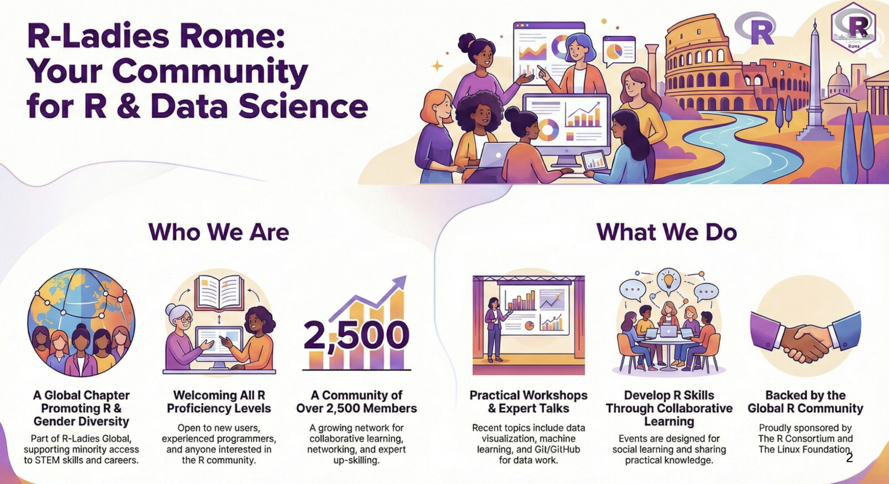
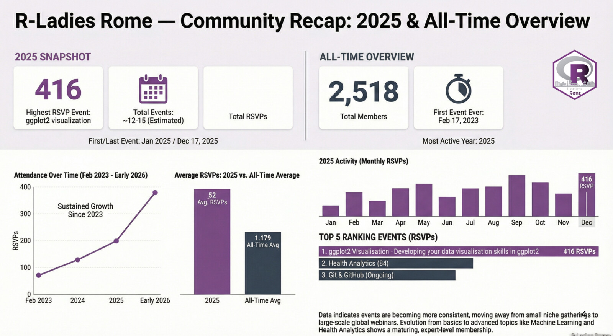
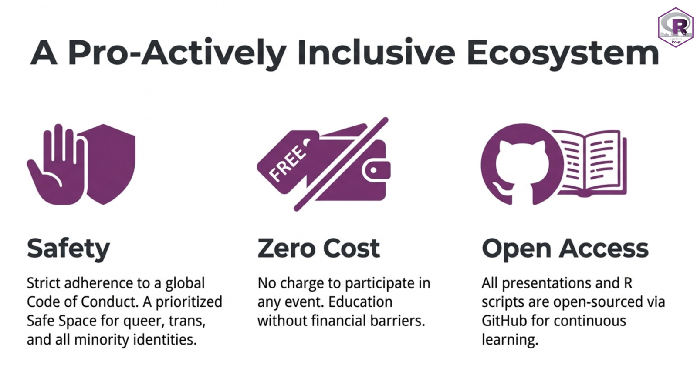
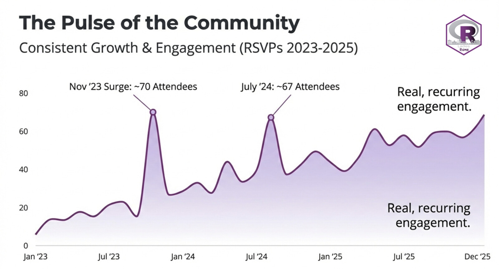
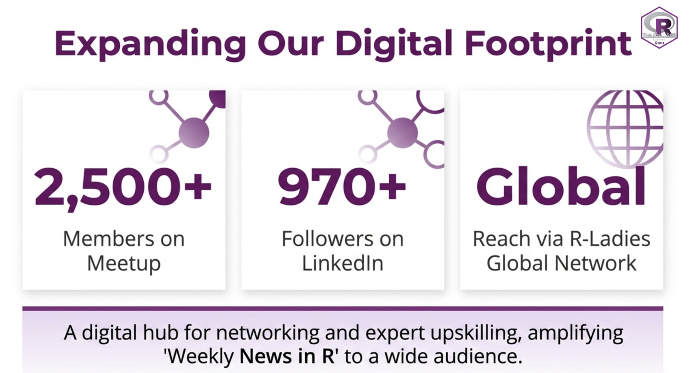

### Reflecting on 2025: A Year of Learning and Growth at R-Ladies Rome 🌟

As we look back on 2025, one thing is clear: R-Ladies Rome continues to grow not only in numbers, but in depth, consistency, and community impact.

This past year has been defined by practical learning, sustained engagement, and a strong commitment to accessible, open, and high-quality technical education.

## 📊 R-Ladies Rome in Numbers

Our 2025 snapshot highlights both growth and momentum:

- **2,500+ Meetup members**
- **1,200+ total RSVPs in 2025**
- **Highest RSVP event: 416 attendees**
- **Average RSVPs per event significantly above historical average**
- **Recurring monthly activity throughout the year**

Compared to our earlier years, engagement has increased steadily, with 2025 showing stronger and more consistent participation across events. What began as a local initiative has evolved into a structured, recurring learning ecosystem.

## 💡 What We Built Together

Throughout the year, we delivered:

- Hands-on workshops in R fundamentals and data wrangling  
- Sessions on reproducible workflows with Quarto and GitHub  
- Applied talks in health analytics and machine learning  
- Community-driven discussions and collaborative learning spaces  

Our focus has always been practical. We do not just present slides — we work with code, data, and real analytical reasoning.

## 🔐 Our Principles Remain the Same

Growth has not changed our core values.

### R-Ladies Rome continues to operate under three foundational principles

These pillars allow us to scale without losing identity.

## 📈 Sustained Engagement, Not One-Off Events

One of the strongest signals in 2025 was recurring participation.

Our engagement is not driven by single viral events, but by consistent attendance, returning participants, and structured programming. This indicates community maturity — learners are not just attending; they are staying.

## 🌍 Part of a Global Movement

R-Ladies Rome is part of the global R-Ladies network and supported by the open-source ecosystem, including the R Consortium and The Linux Foundation.

We are local in presence, but global in reach.

## 🚀 Looking Ahead to 2026

The momentum of 2025 sets the stage for an exciting year ahead.

In 2026, we aim to:

- Expand advanced technical workshops  
- Strengthen collaborations with universities and industry  
- Increase digital content and recorded sessions  
- Continue building structured learning pathways  

Our mission remains clear: empower people to move from learning R to building meaningful, reproducible, real-world projects.

## 🤝 Join Us

Whether you are just starting with R or already working professionally in data science, there is a place for you in this community.

Join us.  
Speak with us.  
Collaborate with us.  

Let’s continue building an inclusive, technically strong, and open data science community in Rome — and beyond.

---

*R-Ladies Rome Organizers*  
Federica Gazzelloni & Rafaela Ribeiro  
www.rladiesrome.org

